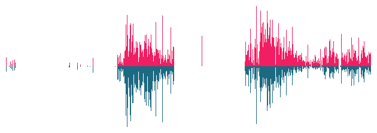

# wechat-chat-visualizer

To be updated...

A tool for you to quickly visualize the messaging history of you and your WeChat friends. The output histogram of various styles illustrates the frequency and quantity of messages you sent to each other from day-one of your *friendship*.

- The tool can only be used for direct messages. Visualization for chatroom history might be updated in the future.
- The current Python version can only output a static image of the visualization. A possible **interactive** one (based on JavaScript) running in browsers might be updated in the future.

## How to use (Python version)

First, please clone this repository to local by running `git clone https://github.com/peilingjiang/wechat-chat-visualizer.git` in Terminal.

0. **Download your WeChat history to local.** To do this, an iPhone user can backup the phone to the computer, then use tools like [iMazing](https://imazing.com/) (works on both PC and Mac) to read and export the backup for the WeChat App. You need to find the file named `MM.sqlite` inside the folder `DB`.
1. **Find the WeChat ID of your friend.** You can normally find the intended ID from the profile page of your friend in the App while it's not always the case. Nevertheless, you can always find the unique ID for the "backstage" from the file `WCDB_Contact.sqlite`. It's under the same directory of the file from the last step. You can use tools like [DB Browser for SQLite](https://sqlitebrowser.org/) to read the file.
2. In `py` folder, put your `MM.sqlite` inside a new folder named `data`.
3. Go to `secret.py` and replace `id` with the actual ID of your friend.
4. **Setup your virtual Python environment.** (Optional but highly recommended.) You can change directory into the repository folder, and run:

        $ python3 -m venv your_venv_name
        $ source your_venv_name/bin/activate
5. Install the requirements by running `pip3 install -r requirements.txt`.
6. Run `python3 src/py/main.py` for the final visualization. A PNG file will be saved to the directory automatically.

****

**Notice:** Please be very cautious when backing up the phone and extracting the backup and prevent any possible loss or leakage of your personal information and data.
